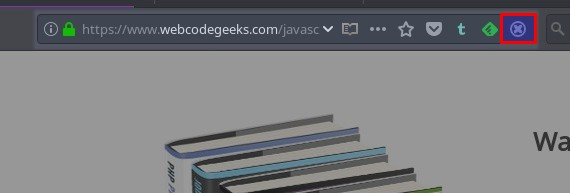

[//]: # (Filename: README.md)
[//]: # (Author: Iván Ruvalcaba)
[//]: # (Contact: <mario.i.ruvalcaba[at]gmail[dot]com>)
[//]: # (Created: 26 dic 2016 16:50:04)
[//]: # (Last Modified: 03 sep 2017 18:52:30)

# Behind The Overlay Revival —Mozilla Firefox WebExtension—

> This project is a fork of [Behind The Overlay](https://github.com/NicolaeNMV/BehindTheOverlay) add-on, ported as _Mozilla Firefox WebExtension_ as well as some improvements implemented.

## What's it all about?

Some websites will use an overlay to mask its content with a transparent background to force you to read a message before you can see the actual content.

I find this very annoying as every site will have a different way to close that overlay popup.

This extension solves this problem by offering you **one button to close any overlay on any website** you may ever encounter.

## WebExtension in action

## Does it work everywhere ?

The extension should work on all sites that have overlays.

## Features

+ Requires no special permissions.
+ Extremely lightweight, relies on little known `document.elementFromPoint` browser's function to find elements that are in front with the highest z-index.
+ Non-intrusive. The extension activates only when you click its button, thereby it has no impact on navigation performance when you don't use the extension. Doesn't inject tons of CSS rules as AdBlock extension is doing for example.
+ Supports hiding of multiple DOM overlay elements.
+ Enables overflow auto of the body when overlay script hides it to disable the scroll of the page.

## Changelog

+ Porting the original complement as _Firefox Web Extension_.
+ Improved the original code.
+ Add to _Behind The Overlay Revival_ one shortcut (`Alt + Shift + x`).
+ English/Spanish translations added (locale support).
+ Implemented a clickable icon inside the browser's address bar (`pageAction`).

## Feedback

If you have any suggestion or comment, please create an issue here. Any feedback is highly appreciated.

## License

Licensed under the [MIT License](http://www.opensource.org/licenses/mit-license.php).

